# Anna Noelle Portfolio

[neffigie.dev](https://neffigie.dev/) is Anna Noelle's portfolio: a durable
record of selected projects and writing, with a canonical public résumé.
PocketBase is the authoring system, while Hugo produces the complete static
site served by AWS Amplify.

Content publication is event-driven. Saving an entry in PocketBase asks
Amplify to build and deploy a fresh version of the whole site. Visitors receive
complete static HTML; their browsers do not query PocketBase.

## Architecture

The production path is **PocketBase → PocketHost hook → Amplify webhook →
publisher → Hugo → Pagefind → static deployment**.

```mermaid
flowchart LR
    PB[PocketBase entries] -->|create, update, or delete| Hook[PocketHost hook]
    Hook -->|POST| Webhook[Amplify incoming webhook]
    Webhook --> Build[Amplify build]
    Build --> Publisher[TypeScript publisher]
    Publisher --> Snapshot[Validated publication snapshot]
    Snapshot --> Hugo[Hugo]
    Hugo --> Search[Pagefind]
    Search --> Deploy[Atomic static deployment]
```



| Component | Responsibility |
| --- | --- |
| PocketBase on PocketHost | Authoritative content and résumé file storage |
| PocketHost hook | Starts a production build after a persisted content change |
| TypeScript publisher | Fetches PocketBase, validates records, excludes drafts, compiles authored HTML, and publishes media |
| Hugo | Produces routes, semantic HTML, metadata, feeds, and the sitemap |
| Pagefind | Builds the search index from the generated site |
| AWS Amplify Hosting | Runs builds and atomically serves the resulting static files |

The deployed site remains on its last successful version while another build
is running. Because every build reads the complete current collection, one
successful build also recovers any changes missed during a webhook outage.

## Résumé

The résumé is a reserved PocketBase entry whose slug is `resume`. It is the
source for the permanent `/resume/` page and its downloadable PDF.

During publication, the publisher validates the record, downloads its current
PDF, and writes the file to a content-addressed static path. Updating either the
record or its file triggers the same complete publication flow as any other
entry, so the page, asset, metadata, and search index are deployed together.

## Repository layout

```text
.
├── packages/
│   ├── publisher/       PocketBase adapter, validation, compilation, and snapshot output
│   └── search/          Shared search state, Pagefind adapter, and search interfaces
├── pocketbase/
│   └── pb_hooks/        Deployable PocketHost publication hooks
├── site/                Hugo configuration, layouts, styles, and generated inputs
├── scripts/             Snapshot, Hugo, and local-preview entry points
├── fixtures/            Deterministic records, media, schema, and expected output
├── tests/               Publication, rendered-site, and browser checks
├── amplify.yml          Amplify build and artifact configuration
└── package.json         Workspace scripts and tool versions
```

Generated snapshots, media, search bundles, and `site/public` are intentionally
ignored. They are reproducible publication artifacts rather than source files.

## Requirements

- Node.js 24.21.0
- npm
- Hugo Extended 0.166.0, installed through the project dependencies

Install dependencies:

```sh
npm install
```

## Local development

The deterministic fixture build does not require PocketBase credentials:

```sh
npm run preview:fixture
```

To preview current PocketBase content, copy the example and replace its values:

```sh
cp .env.example .env.local
npm run preview
```

`.env.local` must define:

```dotenv
POCKETBASE_URL=https://your-instance.pockethost.io
POCKETBASE_SUPERUSER_EMAIL=publisher@example.com
POCKETBASE_SUPERUSER_PASSWORD=replace-me
```

Local environment files are ignored. Do not put real credentials in
`.env.example`.

## Commands

| Command | Purpose |
| --- | --- |
| `npm run snapshot:fixture` | Build a deterministic publication snapshot from fixtures |
| `npm run snapshot:pocketbase` | Fetch PocketBase and build the live publication snapshot |
| `npm run build:site` | Build the fixture snapshot, Hugo site, and Pagefind index |
| `npm run build:site:pocketbase` | Build the production site from current PocketBase content |
| `npm run preview` | Build from PocketBase and serve the result locally |
| `npm run preview:fixture` | Build from fixtures and serve the result locally |
| `npm run lint` | Run Biome checks |
| `npm run typecheck` | Run TypeScript without emitting files |
| `npm test` | Run unit and integration tests |
| `npm run check` | Run lint, type-checking, and unit/integration tests |
| `npm run check:site` | Build the fixture site and run browser tests |

## Publishing from PocketBase

There are two one-time account changes: create an Amplify incoming webhook,
then give its URL to PocketHost as a secret. The repository already contains
the hook at `pocketbase/pb_hooks/amplify-publication.pb.js`.

### 1. Create the Amplify webhook

1. Open the AWS Amplify console and select the `neffigie.dev` application.
2. Go to **Hosting → Build settings**.
3. Find **Incoming webhooks** and choose **Create webhook**.
4. Use the name `pocketbase-publication`.
5. Select the production branch `main`.
6. Create it, then copy both the webhook URL and Amplify's generated `curl`
   command. Treat the URL as a password.

The Amplify app must continue to provide the build-time PocketBase variables
used by `npm run build:site:pocketbase`:

- `POCKETBASE_URL`
- `POCKETBASE_SUPERUSER_EMAIL`
- `POCKETBASE_SUPERUSER_PASSWORD`

### 2. Add the PocketHost secret

1. Open your PocketHost dashboard and select the portfolio instance.
2. Open **Secrets**.
3. Add a secret named exactly `AMPLIFY_BUILD_WEBHOOK_URL`.
4. Paste the Amplify webhook URL as its value and save it.

This secret belongs only in PocketHost. It is intentionally absent from
`.env.example` and must never be committed.

### 3. Upload the hook to PocketHost

Run the following from the repository root. Replace the three uppercase
placeholders first:

```sh
sftp -i "YOUR_KEY_PATH" -P 2222 "YOUR_EMAIL@ftp.pockethost.io"
```

At the `sftp>` prompt, run:

```text
cd YOUR_INSTANCE/pb_hooks
put pocketbase/pb_hooks/amplify-publication.pb.js
ls
bye
```

`YOUR_INSTANCE` is the PocketHost instance name/subdomain, not its full URL.
PocketHost normally reloads `pb_hooks` after a file change. If the hook does
not appear in the instance logs, restart the instance once from the PocketHost
dashboard.

### 4. Publish older changes and verify the connection

1. Run the generated `curl` command from Amplify once. This reconciles database
   edits that happened before the PocketHost hook existed.
2. Watch **Amplify → Deployments** and confirm a `main` build starts without a
   Git commit.
3. Wait for the build to finish, then verify the older PocketBase changes on
   [neffigie.dev](https://neffigie.dev/).
4. Make a harmless edit to an `entries` record in PocketBase and save it.
5. Confirm that another Amplify build starts and that the deployed page reflects
   the new value after the build completes.

## Recovery

If an edit does not publish:

1. Check the PocketHost instance logs for `Amplify publication` messages.
2. Confirm that the `AMPLIFY_BUILD_WEBHOOK_URL` secret still exists and has no
   surrounding whitespace.
3. Run Amplify's generated webhook `curl` command manually.
4. Check the new build under **Amplify → Deployments**.
5. If the build fails, inspect its logs. The build stops rather than deploying
   a partial or invalid publication.

The database edit remains saved even if notification fails. A later successful
manual or automatic build fetches the entire collection and brings the site
back in sync.

## Security

- Never commit PocketBase credentials, `.env.local`, or the Amplify webhook URL.
- Store build-time PocketBase credentials in Amplify's environment/secrets
  configuration.
- Store `AMPLIFY_BUILD_WEBHOOK_URL` only in PocketHost Secrets.
- The hook logs operations, record IDs, and response status codes; it never logs
  authored content or the webhook URL.
